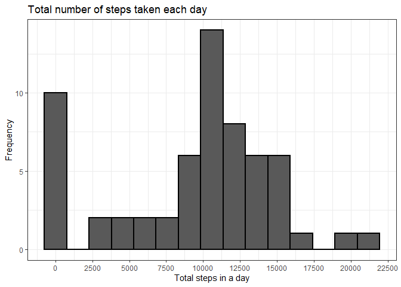
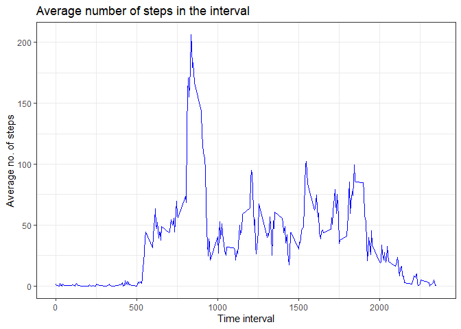
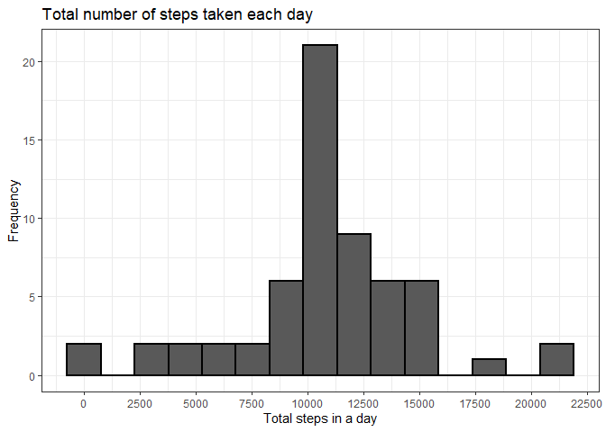
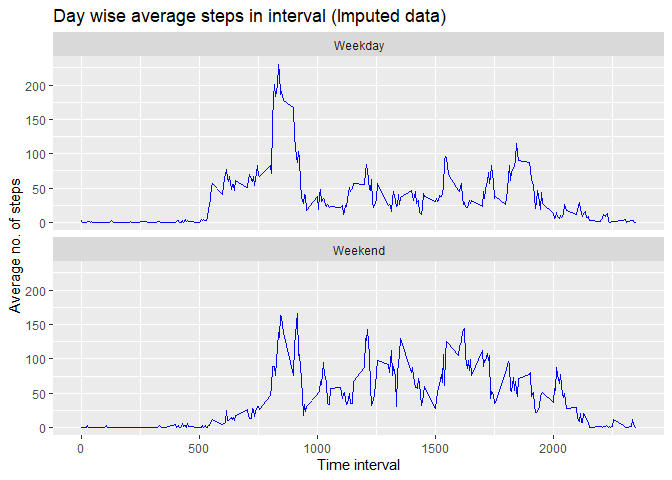

## Loading and preprocessing the data

```r
data = read.csv(unzip('repdata_data_activity.zip'),
                colClasses = c('integer','Date','integer'))
str(data)
```

```
## 'data.frame':	17568 obs. of  3 variables:
##  $ steps   : int  NA NA NA NA NA NA NA NA NA NA ...
##  $ date    : Date, format: "2012-10-01" "2012-10-01" ...
##  $ interval: int  0 5 10 15 20 25 30 35 40 45 ...
```

```r
head(data)
```

```
##   steps       date interval
## 1    NA 2012-10-01        0
## 2    NA 2012-10-01        5
## 3    NA 2012-10-01       10
## 4    NA 2012-10-01       15
## 5    NA 2012-10-01       20
## 6    NA 2012-10-01       25
```

```r
tail(data)
```

```
##       steps       date interval
## 17563    NA 2012-11-30     2330
## 17564    NA 2012-11-30     2335
## 17565    NA 2012-11-30     2340
## 17566    NA 2012-11-30     2345
## 17567    NA 2012-11-30     2350
## 17568    NA 2012-11-30     2355
```

```r
summary(data)
```

```
##      steps             date               interval     
##  Min.   :  0.00   Min.   :2012-10-01   Min.   :   0.0  
##  1st Qu.:  0.00   1st Qu.:2012-10-16   1st Qu.: 588.8  
##  Median :  0.00   Median :2012-10-31   Median :1177.5  
##  Mean   : 37.38   Mean   :2012-10-31   Mean   :1177.5  
##  3rd Qu.: 12.00   3rd Qu.:2012-11-15   3rd Qu.:1766.2  
##  Max.   :806.00   Max.   :2012-11-30   Max.   :2355.0  
##  NA's   :2304
```

## What is mean total number of steps taken per day?

```r
steps_each_day = data %>% group_by(date) %>%
  summarise(Total_steps = sum(steps,na.rm = T))
```

```
## `summarise()` ungrouping output (override with `.groups` argument)
```

```r
ggplot(steps_each_day,aes(x = Total_steps)) +
  geom_histogram(bins = 15,color = 'black',size = 1) + theme_bw() +
  scale_x_continuous(n.breaks = 9) +
  labs(title = 'Total number of steps taken each day') +
  xlab('Total steps in a day') + ylab('Frequency')
```

<!-- -->

```r
mean(steps_each_day$Total_steps)
```

```
## [1] 9354.23
```

```r
median(steps_each_day$Total_steps)
```

```
## [1] 10395
```

## What is the average daily activity pattern?

```r
interval_avg = data %>% group_by(interval) %>%
  summarise(Avg_steps = mean(steps,na.rm = T))
```

```
## `summarise()` ungrouping output (override with `.groups` argument)
```

```r
ggplot(interval_avg,aes(x = interval,y = Avg_steps)) +
  geom_line(color = 'blue') +
  labs(title = 'Average number of steps in the interval',
       x = 'Time interval',y = 'Average no. of steps') + theme_bw()
```

<!-- -->

```r
interval_avg %>% filter(Avg_steps == max(Avg_steps)) %>% pull(interval)
```

```
## [1] 835
```

## Imputing missing values

```r
# Number of rows containing NA
sum(is.na(data))
```

```
## [1] 2304
```

```r
# Imputing NAs with the mean of that 5-minute interval
imputed_data = data %>% group_by(interval) %>%
  mutate(steps = if_else(is.na(steps),
                         as.integer(round(mean(steps,na.rm = T))),
                         steps)) %>% ungroup()

steps_each_day_imputed = imputed_data %>% group_by(date) %>%
  summarise(Total_steps = sum(steps,na.rm = T))
```

```
## `summarise()` ungrouping output (override with `.groups` argument)
```

```r
ggplot(steps_each_day_imputed,aes(x = Total_steps)) +
  geom_histogram(bins = 15,color = 'black',size = 1) + theme_bw() +
  scale_x_continuous(n.breaks = 9) +
  labs(title = 'Total number of steps taken each day',
       x = 'Total steps in a day',y = 'Frequency')
```

<!-- -->

```r
mean(steps_each_day_imputed$Total_steps)
```

```
## [1] 10765.64
```

```r
median(steps_each_day_imputed$Total_steps)
```

```
## [1] 10762
```

## Are there differences in activity patterns between weekdays and weekends?

```r
interval_avg_imputed = imputed_data %>%
  mutate(Day = factor(if_else(weekdays(date) %in% c('Saturday','Sunday'),
                              'Weekend','Weekday'),
                      levels = c('Weekday','Weekend'))) %>%
  group_by(Day,interval) %>% summarise(Avg_steps = mean(steps,na.rm = T)) %>%
  ungroup()
```

```
## `summarise()` regrouping output by 'Day' (override with `.groups` argument)
```

```r
ggplot(interval_avg_imputed,aes(x = interval,y = Avg_steps)) +
  geom_line(color = 'blue') + facet_wrap(.~Day,nrow = 2) +
  labs(title = 'Day wise average steps in interval (Imputed data)',
       x = 'Time interval',y = 'Average no. of steps')
```

<!-- -->

